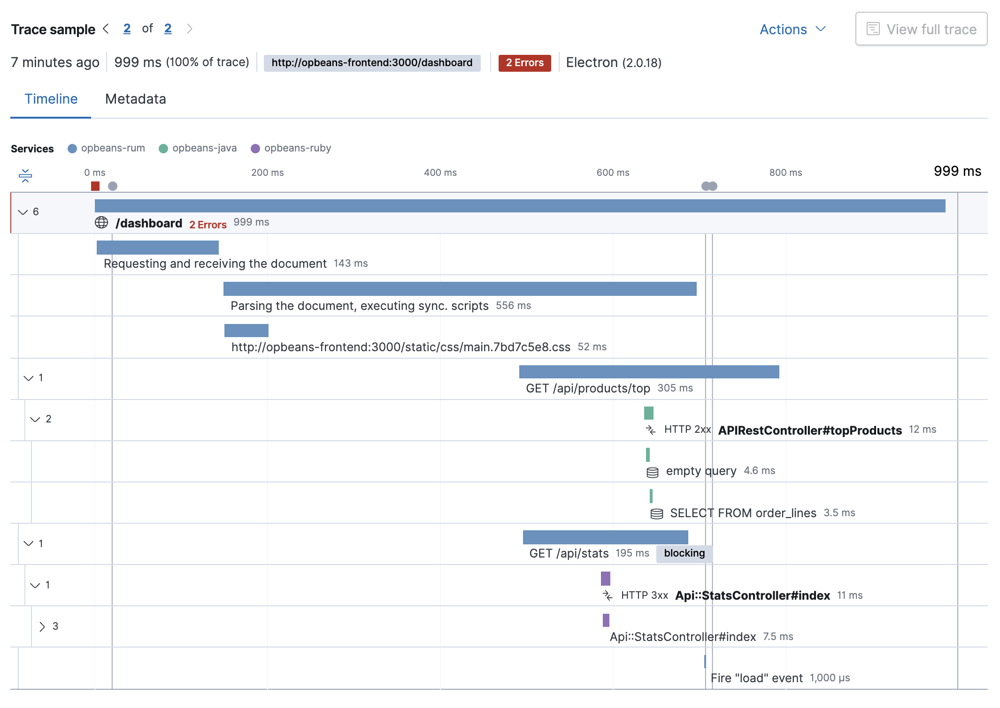

# Трассировка обработки запросов в микросервисных системах (Logging, Distributed Tracing, Performance Monitoring)

## Введение

Здравствуйте, уважаемые читатели. Сегодня хотел бы обсудить тему трассировки обработки запросов в микросервисных системах и подробно рассмотреть такие методы как Logging, Distributed Tracing, Performance Monitoring и другие.

В связи с тем, что в последнее время микросервисная архитектура набирает все большую популярность, трассировка становится очень важным аспектом разработки и поддержки современных приложений. И первым дело хотелось бы начать с начала, то есть рассмотреть само понятие трассировки.

## Трассировка

Трассировка запросов — это метод отслеживания и визуализации всех подзапросов из множества сервисов, которые запускаются в результате выполнения одного конкретного родительского запроса. После начала выполнения программы сервисы взаимодействуют с другими сервисами, базами данных, сторонними зависимостями и выполнение этих внутренних процессов можно отслеживать с помощью трассировки.

**Зачем это всё?**

При выполнении программы у нас могут возникать ошибки. Без трассировки этот процесс может занять уйму времени. Без понимания в какой части программы произошел сбой, с чем он связан, в какой момент выполнения он происходит придется проверить очень большой пласт аспектов. Трассировка же нам помогает сделать это намного быстрее и сильно сузить область поиска проблемы.

**Как это происходит?**

Трассировка происходит примерно следующим образом:

1. Первый этап, это идентификация запроса. После того, как сервису приходит запрос, он назначает ему уникальный идентификатор. Он передается через заголовки HTTP и другие протоколы.
2. На втором этапе происходит логирование(о чем мы поговорим ниже). Каждый сервис логирует идентификатор трассировки
и другие метаданные о выполнении запроса и после этого передает данные дальше по цепочке сервисов.
3. На третьем этапе происходит сбор информации в одном хранилище, в котором происходит агрегация и анализ этих данных.
4. И на последнем этапе происходит визуализация информации. Строится дерево запросов, по которому можно отследить
путь каждого запроса, проанализировать время обработки запроса в каждом конкретном сервисе и проанализировать
полученную информацию.

Теперь давайте рассмотрим, какие же есть методы трассировки и как они помогут выявить проблему.

## Logging

Первый метод, который я уже упоминал, это логирование.
Логирование или журналирование-процесс записи информации о действиях и событиях, происходящих в системе.

**Основные цели использования:**

Этот метод используется для просмотра и анализа работы приложения или системы, поиска и отслеживания ошибок и их устранения.

1. С помощью логирования можно определить место и момент возникновения ошибки, понять причины её возникновения, а так же проследить последствия, к которым она привела.
2. Еще одной функцией журналирования можно назвать мониторинг производительности и нагрузки на различные сервисы, что позволяет разработчикам выявить узкие места системы.
3. Так же логи являются важной частью обеспечения безопасности системы, потому что в них помимо всего отображаются действия пользователей, изменение конфигурации и другие действия пользователей, что и помогает обеспечивать
безопасность и разбираться в причинах возникших инцидентов.

**Как это работает?**

1. Сначала нужно определить, что именно мы будем записывать. Действия пользователя, ошибки, предупреждения и другое.
2. Далее необходимо настроить собственно сам журнал. Нужно определить, в каком формате будут храниться данные, где они будут храниться, уровни логирования(подробнее будут рассмотрены ниже).
3. После этого начинается работа приложения и логи начинаются записываться в журнал. Как правило, там хранится
информация о времени возникновения, типе, источнике, пользователе и других данных.
4. И на последнем этапе разработчики или администраторы системы просматривают и анализируют информацию, сохраненную в журнале.

**Уровни логирования:**

После написания логов мы получаем очень много информации о работе системы и если её никак не разграничивать, получится одна большая куча информации, в которой будет сложно разобраться, поэтому необходимо разделять логи на уровни.

**Существует 4 основных уровня логирования:**

- Error - типичная ошибка
- Warning - нештатная ситуация, потенциальная проблема, может быть странный формат запроса или некорректный параметр вызова
- Debug - запись масштабных переходов состояний, например, обращение к базе данных, старт/пауза сервиса, успешная обработка записи
- Fatal – фатальный сбой работоспособности, когда нет доступа к базе данных или сети, сервису не хватает места на жестком диске

**А также 2 дополнительных:**

- Trace - пошаговые записи процесса. Полезен, когда сложно локализовать ошибку
- Info – общая информация о работе службы или сервиса

**Типы логов:**

Так же существуют разные типы логов. Это так же необходимо для разграничения информации. У каждого лога свой журнал записи.

- системные, связанные с системными событиями
- серверные, отвечающие за процесс обращения к серверу
- почтовые, работающие с отправлениями
- логи баз данных, которые отражают процессы обращения к базам данных
- авторизационные и аутентификационные, которые отвечают за процесс входа, выхода из системы, восстановление доступа и остальное

Логи рекомендуется хранить не только в файлах, но и в базе данных, чтобы можно было делать агрегации.

**Пример использования логирования на языке golang:**

```go
package main

import (
 "fmt"
 "net/http"
 "time"
 "github.com/sirupsen/logrus"
)

func main() {
 // Инициализация логгера
 logger := logrus.New()

 // Обработчик HTTP-запроса
 http.HandleFunc("/hello", func(w http.ResponseWriter, req *http.Request) {
  startTime := time.Now()

  // Логика обработки запроса
  fmt.Fprintf(w, "Hello, world!\n")

  // Логирование обработки запроса
  logger.WithFields(logrus.Fields{
   "method":   req.Method,
   "path":     req.URL.Path,
   "duration": time.Since(startTime),
  }).Info("Request processed")
 })

 logger.Info("Server started")
 http.ListenAndServe(":8080", nil)
}
```

В этом примере мы инициализируем логгер logrus, создаем обработчик HTTP-запроса для эндпоинта "/hello" и используем logrus для логирования обработки каждого запроса. Мы записываем информацию о методе запроса, пути, и времени обработки. Таким образом, мы можем отслеживать обработку запросов через различные микросервисы в нашей системе.

В ней используется небезопасная функция `strcpy`, которая позволяет записать больше данных, чем вмещает выделенный под
них

## Distributed Tracing

Распределенная трассировка-это метод отслеживания путей запросов начиная с первоначального веб-запроса и вплоть до обращения к БД. Главная цель этого метода трассировки-обнаружить узкие места в системе и оптимизировать её.

Кроме того, распределенная трассировка запросов также помогает в отладке и решении проблем, связанных с ошибками и сбоями в системе. Путем анализа трассировочной информации можно определить точное местоположение возникшей проблемы и быстро найти ее причину.

**Цели использования:**

- Анализ производительности системы в разных компонентах и выявление узких мест системы, а так же оптимизация системы
- Отслеживание выполнения запросов, что помогает быстро выявить место ошибки
- Благодаря распределенной трассировки можно анализировать
- Распределенная трассировка позволяет оптимизировать использование ресурсов системы, таких как сетевое соединение, процессорное время и память, путем выявления и устранения избыточных операций
- Распределенная трассировка помогает исправлять проблемы и ошибки при интеграции путем отслеживания двух разных систем или сервисов
- Распределенная трассировка позволяет отслеживать путь выполнения запросов и операций, что помогает обнаружить и предотвратить атаки и уязвимости в системе

**Как работает распределенная трассировка?**

Как я уже писал, при распределенной трассировке отслеживается путь от начала до конца через все сервисы.

**Поэтому получается следующий принцип работы:**

1. Каждый микросервис генерирует уникальные идентификаторы запроса и передает его вместе с запросом дальше по
цепочке сервисов
2. На второй стадии работает распределенный трассировщик. Он принимает информацию о запросах от всех микросервисов и связывает их на вместе на основе guid, что дает возможность отследить путь запроса через все компоненты.
3. Дальше происходит журналирование и агрегация данных, о чем я рассказывал выше
4. На последнем этапе происходит визуализация в каких либо формах

Общий вид выглядит так:


Пример реального графика:



**Основные сущности, которые играют ключевую роль при использовании распределенной трассировки:**

1. Tracer - это компонент, который отвечает за создание, запись и передачу данных трассировки в различные части распределенной системы. Трассировщик обычно генерирует уникальные идентификаторы запросов и связывает различные события внутри системы для построения цепочки запроса
2. Span - это единичное событие в рамках запроса(обработка запроса, вызов удаленного сервиса и т.п.). Отрезки объединяются в цепочку для представления полного пути выполнения запроса.
3. Context - с помощью контекста передается информация между различными компонентами системы. Это используется для того, чтобы обеспечить связность данных трассировки. Контекст содержит уникальный идентификатор запроса и другие метаданные, которые могут быть использованы для анализа и отладки
4. Reporter - используется для отправки данных трассировки из приложения в хранилище данных. Он может быть настроен для отправки данных в реальном времени или асинхронно.
5. Collector - принимает данные трассировки от различных частей системы и объединяет их в централизованное хранилище данных для последующего анализа. Коллектор обеспечивает централизованную точку доступа к данным трассировки.

**Реализация распределенной трассировки на примере языка golang:**

```go
package main

import (
 "context"
 "fmt"
 "log"
 "net/http"

 "github.com/opentracing/opentracing-go"
 "github.com/opentracing/opentracing-go/ext"
 "github.com/opentracing/opentracing-go/log"
 "github.com/uber/jaeger-client-go"
 "github.com/uber/jaeger-client-go/config"
)

func main() {
 // Инициализация и конфигурация трассировщика Jaeger
 cfg := config.Configuration{
  ServiceName: "example-service",
  Sampler: &config.SamplerConfig{
   Type:  "const",
   Param: 1,
  },
  Reporter: &config.ReporterConfig{
   LogSpans: true,
  },
 }
 tracer, closer, err := cfg.NewTracer(config.Logger(jaeger.StdLogger))
 if err != nil {
  log.Fatalf("Failed to initialize Jaeger tracer: %v", err)
 }
 defer closer.Close()
 opentracing.SetGlobalTracer(tracer)

 // Обработчик HTTP-запроса
 http.HandleFunc("/hello", func(w http.ResponseWriter, req *http.Request) {
  spanCtx, _ := opentracing.GlobalTracer().Extract(opentracing.HTTPHeaders, opentracing.HTTPHeadersCarrier(req.Header))
  serverSpan := opentracing.StartSpan("hello", ext.RPCServerOption(spanCtx))
  defer serverSpan.Finish()

  ctx := opentracing.ContextWithSpan(req.Context(), serverSpan)

  // Логика обработки запроса
  fmt.Fprintf(w, "Hello, world!\n")

  serverSpan.LogFields(
   log.String("event", "string-format"),
   log.String("value", "Hello, world!"),
  )
 })

 log.Fatal(http.ListenAndServe(":8080", nil))
}
```

В этом примере мы инициализируем трассировщик Jaeger, создаем обработчик HTTP-запроса для эндпоинта "/hello" и используем OpenTracing для создания и завершения трассировочного спана вокруг обработки запроса. Таким образом, мы можем отслеживать путь запроса через различные микросервисы в нашей системе.

**Популярными системами распределенной трассировки являются:**

- OpenTelemetry
- Jaeger
- Zipkin
- AWS X-Ray

**Трудности с внедрением Distributed Tracing:**

- При сборе и передачи данных трассировки, особенно при большом объеме запросов, может создаваться дополнительная нагрузка на систему
- Обработка и анализ данных трассировки может вызвать проблемы и потребовать дополнительные навыки или дополнительный персонал
- Исправлять какие-то проблемы с трассировкой может быть трудно из-за сложности самой системы трассировки

## Performance Monitoring

**Performance Monitoring** – это процесс сбора и анализа данных о производительности системы. Этот метод отслеживает множество метрик, такие как CPU, память, сетевой трафик, время ответа, время работы микросервиса и другие.

**Для чего используется этот метод?**

- Мониторинг производительности и оптимизация системы
- Проанализировав данные мониторинга можно спрогнозировать будущие проблемы, что позволит своевременно их предотвратить
- Анализ данных мониторинга производительности помогает в планировании расширения или модернизации инфраструктуры для обеспечения ее эффективной работы при увеличении нагрузки

**Общий принцип работы:**

1. Мониторинг и сбор информации о нагрузке системы
2. Далее производится анализ собранных данных для выявления пиковых нагрузок, утечки ресурсов и других проблем
3. Далее данные визуализируются для более удобного реагирования на проблемы системы
4. Дополнительный пункт. В случае обнаружения проблемы или каких то ошибок система может сгенерировать уведомление
и даже принять меры для их устранения

Данный метод должен непрерывно анализировать информацию о производительности системы и вовремя уведомлять о текущих или возможных проблемах и по возможности их исправлять.

Возможно, могло показаться, что функции Performance Monitoring и Distributed Tracing схожи. Но на самом деле это не так. Это два различных подхода к мониторингу и анализу производительности систем.

Основные различия заключаются в следующем:

- Performance Monitoring обычно охватывает широкий спектр метрик производительности системы, включая CPU, память, сеть, нагрузку, а Distributed Tracing фокусируется на отслеживании пути запроса от начала до конца через различные компоненты и сервисы, участвующие в его обработке
- Основной фокус Performance Monitoring - это сбор и анализ общих метрик производительности системы в целом и отдельных компонентов, а Distributed Tracing собирает информацию о прохождении запроса через различные сервисы, включая время обработки каждого сервиса, ошибки и другие метрики, связанные с обработкой запроса
- Performance Monitoring обычно предназначен для обнаружения общих проблем производительности и реагирования на них, например, при превышении пороговых значений метрик, тогда как Distributed Tracing обычно используется для выявления узких мест в обработке запросов, выявления проблем взаимодействия между сервисами и реагирования на них.

Вообще Performance Monitoring ориентируется больше на общей производительности системы, а Distributed Tracing отслеживает путь и ошибки при прохождении запроса через различные компоненты.

**Метрики Performance Monitoring, которые важны при анализе производительности:**

- CPU Utilization - это показатель загрузки процессора. Высокая нагрузка cpu может указывать на неэффективные процессы или программы
- Memory Utilization - этот показатель показывает объем свободной оперативной памяти. Высокое использование памяти может привести к замедлению работы
- Disk I/O - этот показатель демонстрирует скорость операций чтения/записи на диск. Высокая нагрузка на диск может быть причиной замедления работы
- Network Utilization - этот показатель демонстрирует объем переданных данных по сети. Высокое использование сети может указывать на проблемы с пропускной способностью или сетевыми соединениями
- Response Time - это время ответа на запрос. Долгое время ответа может указывать на проблемы производительности
- Error Rate - число ошибок в процессер работы

**Пример реализации Performance Monitoring на языке Golang:**

```go
package main

import (
 "fmt"
 "net/http"
 "time"

 "github.com/prometheus/client_golang/prometheus"
 "github.com/prometheus/client_golang/prometheus/promhttp"
)

var (
 requestDuration = prometheus.NewHistogramVec(prometheus.HistogramOpts{
  Name:    "http_request_duration_seconds",
  Help:    "Histogram of the request duration in seconds.",
  Buckets: []float64{0.1, 0.5, 1, 2, 5},
 }, []string{"handler", "method"})
)

func init() {
 prometheus.MustRegister(requestDuration)
}

func main() {
 http.Handle("/metrics", promhttp.Handler())

 http.HandleFunc("/hello", func(w http.ResponseWriter, req *http.Request) {
  startTime := time.Now()

  // Логика обработки запроса
  fmt.Fprintf(w, "Hello, world!\n")

  // Измерение производительности и запись в метрики Prometheus
  duration := time.Since(startTime).Seconds()
  requestDuration.WithLabelValues("/hello", req.Method).Observe(duration)
 })

 fmt.Println("Server started")
 http.ListenAndServe(":8080", nil)
}
```

В этом примере мы используем библиотеку Prometheus для создания метрик производительности. Мы создаем гистограмму requestDuration, которая измеряет время обработки запросов в секундах и регистрируем ее в Prometheus. Затем мы используем эту гистограмму для измерения времени обработки каждого запроса и записываем результаты в метрики Prometheus.

## Заключение

В этой статье мы рассмотрели методы трассировки запросов в микросервисых системах. Обсудили области применения этих методов, а так же рассмотрели практические примеры данных методов. Теперь вы знаете, почему трассировка запросов важна, как её применять и как выбрать правильные методы для трассировки.
Надеюсь, статья была вам полезна,
Спасибо за внимание!

## Используемые источники

- <https://www.youtube.com/watch?v=_l1qP0DyBcA&t=1s> - Логирование и трассировка запросов. Best Practices – Анатолий Островский
- <https://libeldoc.bsuir.by/bitstream/123456789/37539/1/Kiva_Raspredelennaya.pdf> - РАСПРЕДЕЛЕННАЯ ТРАССИРОВКА, Кива В. С., Брановицкий А. А.
- <https://www.elastic.co/guide/en/observability/current/apm-distributed-tracing.html> - Распределенная трассировка
- <https://expert-apm.kz/blog/about-apm#about-apm-2> - Что такое apm?
- <http://docs.accentos.ru/2.1.0/ru/modules/general-information/general_information/logging.html> - уровни логирования
